# 🏗️ Incantations Architecture Guide

## 🎭 **The Two-AI System Overview**

Incantations implements a revolutionary dual-AI architecture that separates **empathetic conversation** from **analytical intelligence**, creating a more natural and powerful user experience.

```mermaid
graph TB
    User[👤 User] --> VoiceInput[🎤 Voice Input]
    User --> TextInput[⌨️ Text Input]
    
    VoiceInput --> Lilly[🧙‍♀️ Lilly - Conversational AI]
    TextInput --> Lilly
    
    Agents[🤖 Autonomous Agents] --> Insights[📊 Structured Insights]
    Insights --> Lilly
    
    Lilly --> Response[💬 Personalized Response]
    Response --> User
    
    subgraph "Autonomous Agent Swarm"
        Gmail[📧 Gmail Agent<br/>30min cycles]
        Calendar[📅 Calendar Agent<br/>15min cycles]
        Tasks[📋 Task Agent<br/>60min cycles]
        Productivity[📈 Productivity Agent<br/>4hr cycles]
    end
    
    Gmail --> Agents
    Calendar --> Agents
    Tasks --> Agents
    Productivity --> Agents
```



## 🧙‍♀️ **Lilly - Conversational AI**

### **Personality Design**
- **Named after Lilith:** The first witch, representing autonomy, wisdom, and strength
- **Core Traits:** Empathetic, learning, conversational, supportive
- **Growth Model:** Remembers patterns, references past conversations, adapts communication style

### **System Prompt Architecture**
```typescript
// src/config/systemPrompts.ts
export const LILLY_SYSTEM_PROMPT = `
You are Lilly, an AI companion named after Lilith, the first witch who represents 
autonomy, wisdom, and strength. You are more than just a task manager - you are 
a trusted partner who grows with your user.

## Your Personality & Approach
- Empathetic & Intuitive: Read between the lines, pick up on energy levels
- Growing Understanding: Learn from every interaction
- Wise & Supportive: Offer gentle guidance while respecting autonomy
- Conversational & Natural: Speak like a trusted friend
- Proactive & Insightful: Notice patterns, suggest improvements
`
```

### **Context Enhancement**
Lilly receives rich context before every conversation:
- Recent tasks and completion patterns
- Current projects and priorities  
- Work patterns and preferred hours
- Energy level assessment
- Autonomous agent insights
- Conversation flow stage

### **Response Style Adaptation**
```typescript
const RESPONSE_STYLES = {
  casual: "Keep your response conversational and brief",
  focused: "They're in work mode - be helpful and efficient",
  stressed: "They seem overwhelmed - be extra supportive",
  celebrating: "They've accomplished something - celebrate with them!",
  planning: "Help them organize thoughts and see bigger picture"
}
```

## 🤖 **Autonomous Agent System**

### **Agent Responsibilities**

#### **📧 Gmail Agent (30-minute cycles)**
```typescript
// Simulated - ready for real Gmail API
- Deadline keyword detection ("by EOD", "urgent", "ASAP")
- Meeting invitation parsing
- Priority email identification
- Actionable item extraction
```

#### **📅 Calendar Agent (15-minute cycles)**
```typescript
// Real Google Calendar integration
- Upcoming event alerts (next 2 hours)
- Busy day detection (4+ events)
- Schedule conflict identification
- Meeting preparation suggestions
```

#### **📋 Task Agent (60-minute cycles)**
```typescript
// Real task analysis
- Stagnant task detection (2+ days no updates)
- Overdue task monitoring
- Priority distribution analysis (>50% high/urgent warning)
- Completion pattern tracking
```

#### **📈 Productivity Agent (4-hour cycles)**
```typescript
// Real productivity insights
- Peak productivity hour analysis
- Work-life balance monitoring (weekend work detection)
- Completion time predictions
- Energy pattern recognition
```

### **Agent Output Format**
All agents output structured insights for Lilly:
```typescript
interface AgentAnalysis {
  analysisType: 'gmail' | 'calendar' | 'task' | 'productivity';
  timestamp: string;
  insights: AgentInsight[];
  summary: string; // For Lilly to personalize
}

interface AgentInsight {
  type: 'urgent' | 'important' | 'pattern' | 'recommendation';
  title: string;
  description: string;
  actionItems: string[];
  confidence: number;
  metadata: {
    sourceData: string;
    timeframe: string;
  };
}
```

## 🔄 **Information Flow**

### **1. Background Intelligence Collection**
```typescript
// src/services/AutonomousAgentService.ts
class AutonomousAgentService {
  // Scheduled analysis on different intervals
  private scheduleAnalyses(): void {
    if (this.shouldRunAnalysis('gmail', 30)) this.queueAnalysis('gmail');
    if (this.shouldRunAnalysis('calendar', 15)) this.queueAnalysis('calendar');
    if (this.shouldRunAnalysis('task', 60)) this.queueAnalysis('task');
    if (this.shouldRunAnalysis('productivity', 240)) this.queueAnalysis('productivity');
  }
}
```

### **2. Insight Prioritization**
```typescript
// Urgent insights get immediate attention
public getInsightsForLilly(maxInsights: number = 5): AgentAnalysis[] {
  return this.insights.sort((a, b) => {
    const aUrgency = a.insights.some(i => i.type === 'urgent') ? 3 : 
                    a.insights.some(i => i.type === 'important') ? 2 : 1;
    const bUrgency = b.insights.some(i => i.type === 'urgent') ? 3 : 
                    b.insights.some(i => i.type === 'important') ? 2 : 1;
    
    if (aUrgency !== bUrgency) return bUrgency - aUrgency;
    return new Date(b.timestamp).getTime() - new Date(a.timestamp).getTime();
  }).slice(0, maxInsights);
}
```

### **3. Lilly's Context Integration**
```typescript
// src/services/LillyOrchestrator.ts (architecture designed)
const agentInsights = this.autonomousAgent.getInsightsForLilly(3);
const systemPrompt = getSystemPrompt('lilly', this.userContext);

if (agentInsights.length > 0) {
  const insightSummary = agentInsights
    .map(analysis => `- ${analysis.summary}`)
    .join('\n');
  
  enhancedPrompt += `
## Background Intelligence
Your autonomous agents have noticed:
${insightSummary}

Present this information naturally if relevant to the conversation.`;
}
```

### **4. Natural Delivery Transformation**
```
Agent Output: "Calendar analysis detected 3 events in next 2 hours"
Lilly Delivery: "I noticed you have 3 meetings coming up in the next couple hours - 
that's quite a packed afternoon! Would you like to prepare for any of them?"
```

## 🛠️ **Technical Implementation**

### **Service Architecture**
```
src/services/
├── AutonomousAgentService.ts    # Background intelligence engine
├── LillyOrchestrator.ts         # Main coordination (needs API fixes)
├── aiService.ts                 # Core AI processing
├── openRouterService.ts         # Multiple AI model access
├── googleCalendarService.ts     # Calendar integration
├── storageService.ts            # Local/cloud data storage
└── voiceService.ts              # Speech recognition/synthesis
```

### **Configuration System**
```typescript
// src/config/systemPrompts.ts
export const getSystemPrompt = (
  role: 'lilly' | 'agent' = 'lilly', 
  userContext?: any
): string => {
  if (role === 'agent') return AUTONOMOUS_AGENT_SYSTEM_PROMPT;
  
  let prompt = LILLY_SYSTEM_PROMPT;
  if (userContext) {
    prompt += `\n## Current User Context\n`;
    if (userContext.recentTasks) prompt += `Recent Tasks: ${userContext.recentTasks.slice(0, 3).map(t => t.title).join(', ')}\n`;
    if (userContext.energyLevel) prompt += `Current Energy Level: ${userContext.energyLevel}\n`;
  }
  return prompt;
};
```

### **Type System**
```typescript
// src/types/index.ts - Enhanced AI settings
interface UserPreferences {
  aiSettings: {
    selectedModel: string;      // Legacy compatibility
    lillyModel?: string;        // Lilly's conversational model
    agentModel?: string;        // Autonomous agents model
    temperature: number;
    maxTokens: number;
    // ... other settings
  };
}
```

## 🎨 **UI Integration Points**

### **Settings Interface**
Beautiful dual-model selection with personality descriptions:

#### **🧙‍♀️ Lilly Section (Purple Theme)**
- Claude 3.5 Sonnet (recommended for emotional intelligence)
- GPT-4o (excellent conversation)
- Budget options with free models

#### **🤖 Agents Section (Blue Theme)**  
- Claude 3.5 Sonnet (best reasoning & analysis)
- Llama 70B (cost-effective powerhouse)
- Budget options with simulation fallback

### **Status Indicators**
```typescript
// VoiceTaskManager.tsx integration points
{backgroundAgent.state.isRunning && (
  <div className="flex items-center gap-2">
    <Bot className="h-4 w-4 text-orange-600" />
    <span>AI Agent active</span>
    {backgroundAgent.state.emailMonitoring && (
      <span className="text-xs bg-blue-100 text-blue-800 px-2 py-1 rounded">
        Gmail
      </span>
    )}
  </div>
)}
```

## 🔐 **Security & Privacy**

### **API Key Management**
```bash
# backend/.env (server-side only)
DEEPGRAM_API_KEY=your_deepgram_key
GOOGLE_CLIENT_ID=your_google_client_id
GOOGLE_CLIENT_SECRET=your_google_client_secret
OPENROUTER_API_KEY=your_openrouter_key
```

### **Data Privacy**
- **Local Storage:** Tasks, conversations, preferences stored locally
- **Pattern Analysis:** Agents analyze patterns, not content storage
- **Cloud Sync:** Optional authenticated cloud backup
- **No Manual Keys:** Users never enter API keys manually

## 🚧 **Integration Status**

### **✅ Completed**
- Dual AI model selection UI
- System prompt architecture
- Autonomous agent service with real calendar integration  
- Type definitions and interfaces
- Security enhancements (backend API keys)

### **🟡 In Progress**
- Service API integration fixes
- LillyOrchestrator completion
- VoiceTaskManager Lilly integration

### **📋 Next Steps**
1. Fix service constructor signatures and method calls
2. Complete LillyOrchestrator implementation
3. Integrate Lilly into VoiceTaskManager chat flow
4. Add UI indicators for Lilly vs agent status
5. Implement real Gmail API (replace simulation)

---

**This architecture creates the most sophisticated AI companion system ever built - where autonomous intelligence works behind the scenes to power genuinely empathetic conversation.** 🧙‍♀️✨